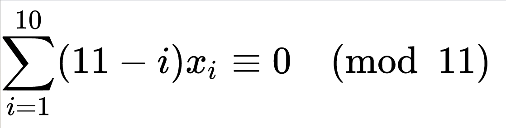

# Generate số tài khoản ngân hàng
Bạn sẽ làm gì nếu được giao 1 task sau:

Khi mỗi khách hàng đến ngân hàng cần tạo cho khách hàng một số tài khoản để định danh khách hàng, yêu cầu số tài khoản này không `"dễ dàng"` đoán được (predictable), số tài khoản này phải nhúng được các thông tin như mã chi nhánh mở tài khoản, và có thể dễ dàng verify sớm tránh hit xuống database để kiểm tra những tài khoản không hợp lệ.

## Nếu là Tâm được giao task này Tâm sẽ làm như thế nào ?
Trước khi vào làm chúng ta thử phân tích một vài khía cạnh của bài toán để xem xét một vài vấn đề.

Yêu cầu thứ nhất của bài toán là `số tài khoản để định danh khách hàng, yêu cầu số tài khoản này không dễ dàng đoán được (predictable)`. Để làm tốt yêu cầu này tốt nhất là chúng ta tạo số tài khoản ngẫu nhiên, tức là có một bộ sinh số ngẫu nhiên tốt, mà bộ sinh số này không dễ đễ viết ngay cả bản thân của những `library` sinh số ngẫu nhiên cũng có vấn đề riêng của họ, nếu không đọc kỹ doccument của họ dễ đẫn đến nhũng sai lầm `"chết người"` và cũng không thể đùng hàm `random` thông thường được `buildin` trong các ngôn ngữ lập trình được, lúc test lấy `random.seed` set value mà quên xóa là khả năng lỗi rất cao. Hơn nữa yêu cầu thứ 2 của bài toán là chúng ta cần nhúng thêm thông tin vd: `mã chi nhánh` vào trong số tài khoản nếu làm `random` thì với kiến thức hiện tại mình không nghĩ ra cách để làm nếu ai biết cách làm có thể chia sẽ với mình nhé =).

Yêu cầu thứ 3 là `dễ dàng verify sớm tránh hit xuống database để kiểm tra những tài khoản không hợp lệ` ý này tức là mình sẽ không đi verify những số tài khoản mà mình biết chắc chắn là hệ thống mình không sinh ra sô tài khoản như vậy, để giảm áp lực cho `database` hơn nữa chúng ta có thể check tại một thời điểm mà có nhiều `request` đến mà `Brute Force` dò các số tài khoản (sai nhiều lần) thì xem xét block những `request` đến từ thiết bị đó, hoặc đối tác đó.

Giải pháp mình đưa ra ở đây là giải pháp lúc mình đi học tự suy luận ra từ những kiến thức đã có và đã được học (kiến thức nông cạn của mình) mình không biết những ngân hàng thực tế có dùng giải pháp này không, có thể có nhiều lỗ hổng nếu bạn đọc nào biết được thì chỉ giáo nhé. =)) `let go`

Lý thuyết toán học mình áp đụng ở đây là ring(vành), group (nhóm), subgroup(nhóm con) liên quan tới toán đại số. Nếu bạn đọc quan tâm có thể đọc ở đây ([ring](https://en.wikipedia.org/wiki/Ring_(mathematics)), [group](https://en.wikipedia.org/wiki/Group_(mathematics)))

> quote: " Toán Đại Số là gì? Đại là lớn, vậy Toán mà làm với số lớn thì gọi là Toán Đại Số". 

Một trong ứng dụng phổ biên của lý thuyết toán ở trên là [International Standard Book Number](https://en.wikipedia.org/wiki/International_Standard_Book_Number) (ISBN) đây là chuẩn để định danh các đầu sách xuất bản trên toàn thế giới. Và mình cũng dựa trên ý tưởng của `ISBN` cụ thể `ISBN 11`(có 11 chữ số) này để xây đựng thuật toán tạo số tài khoản của mình.

## Implementation

Về cơ bản về ISBN `11` đang dùng vành $Z_{11}$ khi một con số được sinh ra nó phải thỏa điều kiện sau:



Với $x_i$ là chữ số thứ `i` trong chuỗi được sinh ra. Đựa trên công thức này mình dùng phát sinh 1 số tài khoản như sau, chuỗi được sinh ra được chia làm 3 phần phần đầù tiên là `prefix`- chứa mã ngân hàng gồm (`2-3 chữ số` ), phần số generate ra, 1 số `checksum` cuối cùng:
``` javascript
const digits = [0, 1, 2, 3, 4, 5, 6, 7, 8, 9]
const genarate11Digit = (prefix, isShuffle) => {
  prefix = `${prefix}`
  let prefixLengh = prefix.length
  let numOfDigitRandom = digits.length - prefixLengh
  let accountDitgits = []
  for (let i = 0; i < prefixLengh; i++)
    accountDitgits.push(parseInt(prefix[i]))

  numOfDigitRandom -= 1
  while (numOfDigitRandom !== 0) {
    accountDitgits.push(randomChoice(digits))
    numOfDigitRandom--
  }
  const checksum = caculatorModulur(accountDitgits) // tính theo công thức ISBN
  accountDitgits.push(checksum)
  isExist = true
  if (isShuffle) 
    accountDitgits = shuffle(accountDitgits) // hàm trộn các chữ số
  return accountDitgits
}
const caculatorModular = digits => {
  sum = 0
  for (let i = 0; i < digits.length; i++)
    sum += digits[i] * (10 - i)
  return sum  % 11
}
const randomChoice = arr => arr[Math.floor(arr.length * Math.random())]
```

ý tưởng ở đây là sinh ra 1 con số gồm 3 phần như sau `'mã ngân hàng-phần số sinh ra-1 số checksum'`. Mã ngân hàng là phần thông tin cần nhúng thường 2, 3 chữ số (vd 3 chữ số là có thể có từ 0-999 là 1000 chi nhánh). ví dụ ở đây là 3 + 1 số checksum tổng là 4. vậy số cần sinh ra là `11 - 4 = 7`. ở đây đơn giản là chúng ta chọn random trong 9 chữ số từ `[0-9]`, lý giải một chút tại sao chỗ này dùng `random` thì không sao vì chỗ này chúng ta `random` 1 tập hữu hạn có kiểm soát, còn `random` đầu bài đề cập là `random` không kiểm soát. Sau khi `random` xong thì ta cần tính `checksum` đơn giản là lấy 10 chữ số vừa tạo ra, tính theo công thứ của `ISBN` lưu ý chỗ này nếu tính `ISBN` ra số 10 thì chúng ta quy ước là bỏ luôn checksum số tài khoản chỉ có 10 số. Theo chuẩn `ISBN` thì số 10 được mã thành chữ `X` nhưng ở đây chúng ta chỉ muốn tạo số.Sau khi tạo xong thì chúng ta có tùy chọn trộn các chữ số này lại với nhau. Nếu trộn lại thì bảo mật hơn nhưng nó cũng có khuyết điểm so với không trộn là nếu không trộn thì có 1 nhân viên nào đó kinh nghiệm làm ở ngân hàng `X` này nhiều năm thì họ chỉ cần nhìn `prefix` là biết nơi mở tài khoản. Tránh mất thời gian tra các thông tin khác nếu giao dịch không cần thiết. Lưu ý khi trộn thì chúng ta phải lưu lại cái vị trí trộn để restored lại số ban đầu. Nói cách khác chúng ta giấu cách trộn.

## check số tài khoản hợp lệ
Để check số tài khoản đầu tiên chúng ta implement công thức tính của `ISBN 11` có thể implement 1 cách dễ hiểu như hàm `caculatorModular` bên dưới. Hoặc có 1 chút toán như `CheckISBN` trên wiki mà mình đặt tên là `checkHackBrain` vì công thức này liên quan tới `chuỗi số` nếu không học chắc toán thì khá khó hiểu nếu nhìn vào code của hàm này.
``` javascript
const caculatorModular = digits => {
  sum = 0
  for (let i = 0; i < digits.length; i++)
    sum += digits[i] * (10 - i)
  return sum  % 11
}

/* CheckISBN
** https://en.wikipedia.org/wiki/International_Standard_Book_Number
*/
const checkHackBrain = digits => {
  let i, s = 0, t = 0
  for (i = 0; i < 10; i++) {
    t += digits[i]
    s += t
  }
  return s % 11
}
```
## Bàn luận về vấn đề có trộn hay không trộn chuỗi được sinh ra
Để nói về vấn đề này chúng ta xem lại về hàm `caculatorModular` về cơ bản mỗi con số sinh ra có một trọng số từ `[1, 10]` sau khi nhân với trọng số và tính tổng chúng ta đem `modulo` cho 11 ra con số checksum khi verify chúng ta đơn giản tính lại và so 2 con số checksum. Nếu không 2 con số này giống nhau thì là 1 dãy sô hợp lệ. Bây giờ chúng ta thử set vấn đề `Brute Force` tuyến tính. Nếu cứ đơn giản +1 lên cho 1 con số rồi thử thì sau khoảng 10 lần lặp thì chúng ta mới tìm được con số hợp lệ vì khi ta cộng 1 đơn vị vào cuối cùng thì chúng ta đnag cộng vào con số `checksum` thì trong 10 số từ `[0, 9]` thì chỉ có 1 chữ số hợp lệ đúng bằng phép tính `modular` khi ta tăng tới con số hàng chục thì cũng phải dò tới con sô hợp lệ tiếp theo ở hàng đơn vị như vậy cần khoảng 20 lần lặp thì mới tìm được 2 chuỗi hợp lệ. Vậy đối với cách `bute force` thông thường như vầy thì chúng ta có thể đựa trên số lượng lỗi của những request đến cùng một thiết bị hay một nguồn nào đó.

Bây giờ chúng ta xét đến một trường hợp `smart bute force` do chúng ta đã biết công thức để generate số tài khoản này và tính toán `checksum` vậy chúng ta hoàn toàn có thể tự `generate` ra một số tài khoản sau đó các bước kiểm tra ở trên đều `pass` và chúng ta phải hit xuống database để kiểm tra và lấy thông tin vậy có khả năng bị lộ thông tin và điều này không đảm bảo được tính `"khó đoán"` mà bài toán yêu cầu. Vậy câu hỏi là có cách nào chúng ta vùa dùng cách vừa rồi mà vẫn đảm bảo được tính khó đoán không ? `"Có"` đó là trước khi trả về con số đó chúng ta trộn `shuffle` nó lên theo 1 quy tắc nào đó mà chỉ chúng ta mới biết. Nói cách khác là trộn xong giấu cách trộn.Do chúng ta giấu cách chọn đi rồi nên khi không biết cách trộn nên việc tìm ra cách chúng ta tạo ra các con số này không hề đễ dàng. Và hoàn toàn có thể đùng cách check những req đến cùng 1 nguồn có tỉ lệ lỗi cao block nó. Thực tế dù có trộn hay không thì nếu `bute force` thì cứ trung bình cứ 10 lần đoán theo kiểu +1 bạn có 1 lần đoán trúng tỉ lệ trúng là 10%. phần này mình có test lại trong code bạn có thể chạy code trong phần testing để kiểm chúng. Hơn nữa điều này có là đo nhiều tính chất đặc biệt của vành như tính có phần tử đơn vị hay nhóm giao hoán.

## Về mặt implementation
ở đây để đơn giản không đặt nặng quá nhiều toán nên mình chỉ cần `random` chọn các con số `[0, 9]` trong mỗi lần `generate` các con số chứ về mặt thực tiễn thì hoàn toàn có cách để sinh các con số này sao cho ít đụng độ nhât. Liên quan tới lý thuyết về `trường, vành` các bạn quan tâm có thể tìm đọc thêm những tài liệu này.

## Testing

### 1.Ở đây mình sẽ thử viết các hàm gen ra `1 triệu` số tài khoản trộn và `1 triệu` số tài khoản không trộng xem thử sụ khác biệt về ngẫu nhiên và số lần đụng độ như thế nào.
thử chạy command line như sau:

`node testingIdGenarator.js -nonsuff`

sẽ gen ra `1000000` số tài khoản không trộn với số lần đụng độ là `53490`.đưới đây là 10 số tài khoản gen ra
``` sh
4725924856
47260607229
47229111282
47268454573
47238709493
47298753154
47288227086
4724674287
47205821895
47252866822
47204365156
```
`node testingIdGenarator.js -suff`

sẽ gen ra `1000000` số tài khoản không trộn với số lần đụng độ là `41`. đưới đây là 10 số tài khoản gen ra
``` sh
66821364017
32718836108
58322905329
24261261610
57355945911
5723799491
66464716736
5437707582
77536120642
38013460665
18762144859
```
có thể thấy nếu chúng ta trộn các chữ số thì số lần đụng độ cũng giảm. Hơn nữa nhìn cũng gần với khái niệm ngẫu nhiên
### 2. Ở đây mình thử check khoảng `1000000` lần `bute force` verify số tài khoản không được trộn và `1000000` lần cho trường hợp `bute force` đỗi với các chữ số đã chọn để xem thử tỉ lệ đò trúng là bao nhiêu.
nếu các chữ số không được trọn số chữ số pass verify là 90909/1000000 = 0.090909 tương đương 9,1%
```
num account pass verify digits 90909
```
nếu các chữ số không được trọn số chữ số pass verify là 90910/1000000 = 0.09091
tương đương 9,1%
```
num account pass verify digits 90910
```
như đã chia sẽ ở trên tỉ lệ này sẽ không đổi cho dù chúng ta có trộn hay không trộn các chữ số. Do các tính chất chất của `vành`. việc chúng ta trộn các chữ số này nhằm giấu cách chúng ta sinh ra các chữ số để người khác dò được.
# Các vấn đề mở rộng
1. cần genarate id ngẫu nhiên mang các thông tin khác những vẫn đảm bảo tính ngẫu nhiên.
2. generate ra số trong thẻ cào điện thoại `game`, - có giới hạn số lần thử sai